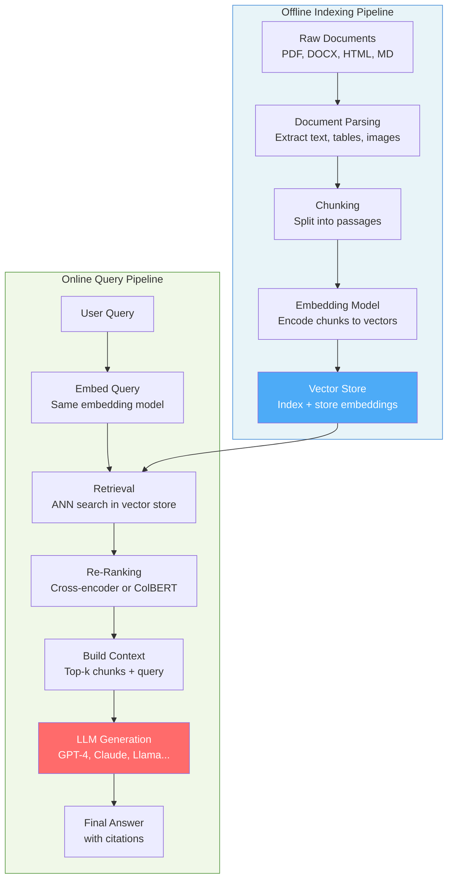
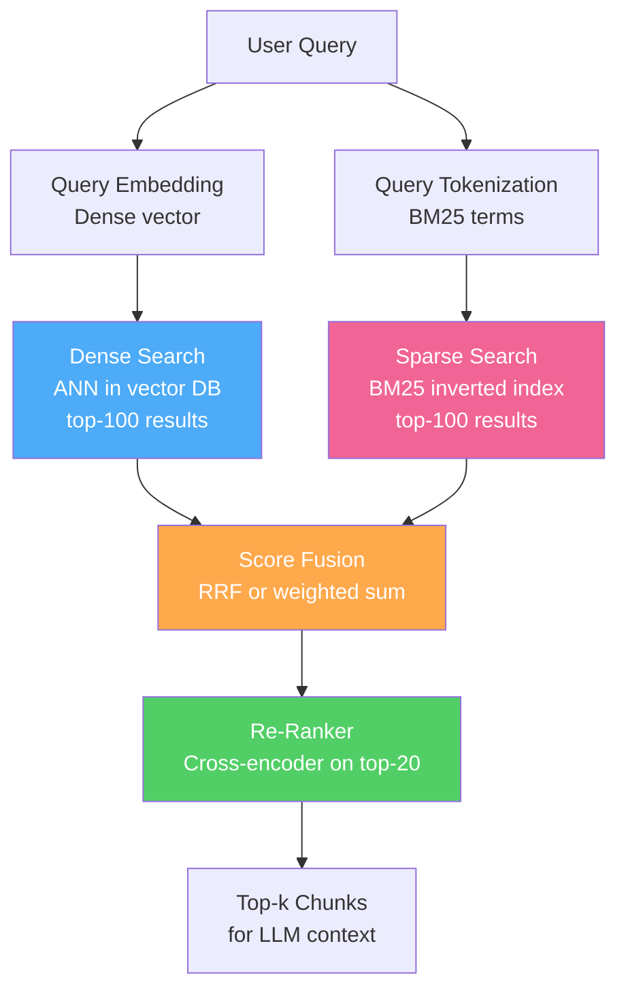
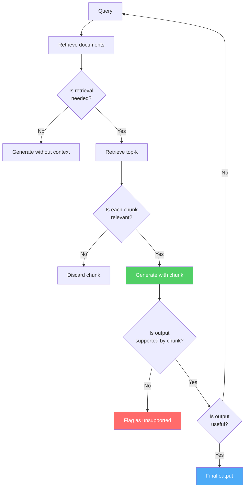
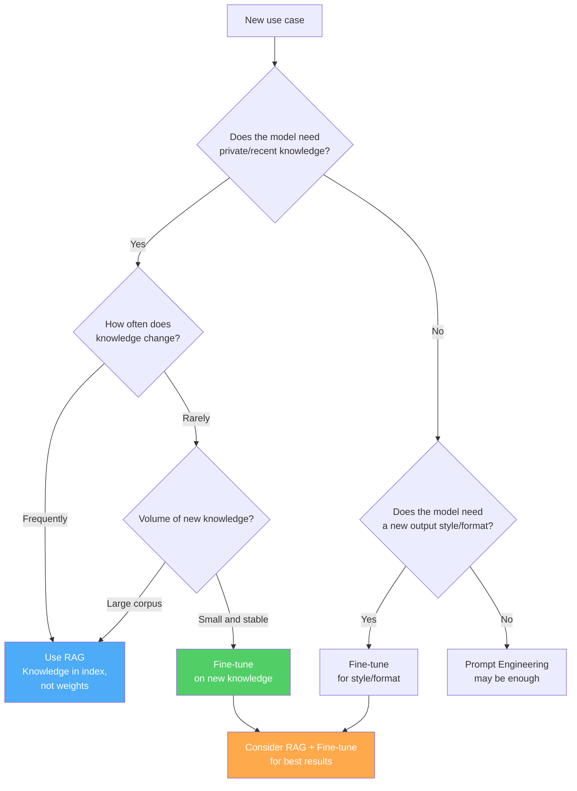

# Retrieval-Augmented Generation (RAG): A Complete Reference

> A comprehensive guide to RAG system architecture, chunking strategies, embedding models, vector databases, retrieval algorithms, re-ranking, hybrid search, and advanced techniques — with diagrams throughout.

---

## Table of Contents

1. [What is RAG?](#1-what-is-rag)
2. [RAG Architecture](#2-rag-architecture)
3. [Document Processing & Chunking](#3-document-processing--chunking)
4. [Embeddings](#4-embeddings)
5. [Vector Databases](#5-vector-databases)
6. [Retrieval Algorithms](#6-retrieval-algorithms)
7. [BM25 & Sparse Retrieval](#7-bm25--sparse-retrieval)
8. [Hybrid Search](#8-hybrid-search)
9. [ColBERT & Late Interaction](#9-colbert--late-interaction)
10. [Re-Ranking](#10-re-ranking)
11. [Advanced RAG Patterns](#11-advanced-rag-patterns)
12. [Evaluation](#12-evaluation)
13. [RAG vs Fine-Tuning](#13-rag-vs-fine-tuning)
14. [Quick Reference](#14-quick-reference)

---

## 1. What is RAG?

**Retrieval-Augmented Generation** combines a retrieval system with a generative language model. Instead of relying solely on parametric knowledge (weights), the model is grounded at inference time with relevant documents fetched from an external knowledge base.

### 1.1 The Core Problem RAG Solves

```
  Pure LLM (no RAG):                    LLM + RAG:
  ──────────────────                     ──────────
  User: "What is our Q3 revenue?"        User: "What is our Q3 revenue?"
                                                      │
  LLM: "I don't have access to           ┌───────────▼──────────────┐
        your internal data."             │  Retrieve Q3 report docs  │
                                         └───────────┬──────────────┘
  OR worse:                                          │
  LLM: (hallucinates a number)           LLM: "Based on your Q3 report,
                                               revenue was $4.2M, up
                                               12% from Q2."
```

### 1.2 Why RAG over Fine-Tuning?

| Concern | Fine-Tuning | RAG |
|---------|------------|-----|
| Knowledge updates | Retrain required | Update index only |
| Cost | High (GPU hours) | Low (index update) |
| Hallucination | Still occurs | Grounded in retrieved docs |
| Source attribution | Hard | Natural (cite chunks) |
| Private data | Baked into weights (risk) | Stays in your DB |
| Latency | Fast (no retrieval) | Adds retrieval step |
| Knowledge cutoff | Fixed at training | Always up-to-date |

---

## 2. RAG Architecture

### 2.1 High-Level Pipeline



### 2.2 Detailed Component Breakdown

```
  ┌─────────────────────────────────────────────────────────────────────┐
  │                        INDEXING PIPELINE                            │
  │                                                                     │
  │  [PDF/HTML/DOCX]                                                    │
  │       │                                                             │
  │       ▼                                                             │
  │  ┌─────────────┐    ┌──────────────┐    ┌──────────────────────┐  │
  │  │  Parser     │───►│   Chunker    │───►│   Embedding Model    │  │
  │  │  PyMuPDF    │    │  fixed-size  │    │   text-embedding-3   │  │
  │  │  Unstructd  │    │  semantic    │    │   BGE, E5, GTE       │  │
  │  │  LlamaParse │    │  recursive   │    │   [chunk → vector]   │  │
  │  └─────────────┘    └──────────────┘    └──────────┬───────────┘  │
  │                                                     │              │
  │                                          ┌──────────▼───────────┐  │
  │                                          │    Vector Database   │  │
  │                                          │    Pinecone / Weaviate│ │
  │                                          │    Qdrant / pgvector │  │
  │                                          │    FAISS / Chroma    │  │
  │                                          └─────────────────────┘  │
  └─────────────────────────────────────────────────────────────────────┘

  ┌─────────────────────────────────────────────────────────────────────┐
  │                        QUERY PIPELINE                               │
  │                                                                     │
  │  User Query ──► [Query Transform] ──► [Embed Query]                │
  │                                              │                      │
  │                              ┌───────────────▼─────────────┐       │
  │                              │     Hybrid Retrieval         │       │
  │                              │  Dense (ANN) + Sparse (BM25) │       │
  │                              └───────────────┬─────────────┘       │
  │                                              │                      │
  │                              ┌───────────────▼─────────────┐       │
  │                              │       Re-Ranker              │       │
  │                              │  Cross-encoder / ColBERT     │       │
  │                              └───────────────┬─────────────┘       │
  │                                              │                      │
  │                              ┌───────────────▼─────────────┐       │
  │                              │     Context Assembly         │       │
  │                              │  Prompt = query + top-k docs │       │
  │                              └───────────────┬─────────────┘       │
  │                                              │                      │
  │                                    ┌─────────▼────────┐            │
  │                                    │    LLM Call      │            │
  │                                    │  Generate Answer │            │
  │                                    └──────────────────┘            │
  └─────────────────────────────────────────────────────────────────────┘
```

### 2.3 Naive RAG vs Advanced RAG vs Modular RAG

```
  Naive RAG (2020-2022):
  ──────────────────────
  Query → Retrieve → Generate
  Simple, brittle, no query understanding

  Advanced RAG (2023):
  ────────────────────
  Query → [Transform] → Retrieve → [Re-rank] → [Filter] → Generate
  Better precision, handles complex queries

  Modular RAG (2024):
  ───────────────────
  Plug-and-play components, routing, agents, self-correction
  Query → [Route] → [Multi-step Retrieve] → [Verify] → [Generate] → [Critique]
```

---

## 3. Document Processing & Chunking

Chunking is arguably the most impactful decision in a RAG pipeline. The chunk is what gets retrieved — too large and it adds noise; too small and it loses context.

### 3.1 Why Chunking Matters

```
  Document: 50-page technical manual

  Scenario A — Chunk too large (entire sections):
  ┌────────────────────────────────────────────────────────────┐
  │ Section 3: Installation (2000 tokens)                      │
  │ 3.1 Requirements ... 3.2 Steps ... 3.3 Troubleshooting ... │
  └────────────────────────────────────────────────────────────┘
  Retrieved for "how to install on Windows"
  ✗ Fills context window with irrelevant content
  ✗ LLM must find the answer in noise

  Scenario B — Chunk too small (single sentences):
  ┌──────────────────────────────────┐
  │ "Run the installer as admin."    │
  └──────────────────────────────────┘
  ✗ Missing surrounding context
  ✗ "installer" — what installer? What version?

  Scenario C — Chunk just right (~200-500 tokens with overlap):
  ┌──────────────────────────────────────────────────────┐
  │ 3.2 Windows Installation                              │
  │ Download the .exe from downloads.example.com.        │
  │ Right-click → Run as Administrator. Accept the EULA. │
  │ Choose install path. Click Install. Restart required. │
  └──────────────────────────────────────────────────────┘
  ✓ Self-contained, answerable
  ✓ Tight enough to be specific
```

### 3.2 Chunking Strategies

#### Fixed-Size Chunking

```
  Document: [tok1 tok2 tok3 ... tok1000]

  chunk_size=200, overlap=50:

  Chunk 1: [tok1  ... tok200]
  Chunk 2: [tok151 ... tok350]   ← 50-token overlap with chunk 1
  Chunk 3: [tok301 ... tok500]
  ...

  Pros: Simple, predictable, fast
  Cons: Splits mid-sentence, mid-concept; arbitrary boundaries
```

#### Sentence-Based Chunking

```
  Document split at sentence boundaries using spaCy / NLTK:

  [Sent1. Sent2. Sent3.] [Sent4. Sent5.] [Sent6. Sent7. Sent8.]
         Chunk 1              Chunk 2            Chunk 3

  Pros: Respects linguistic boundaries
  Cons: Sentences vary wildly in length; very short sentences
```

#### Recursive Character Splitting (LangChain default)

```
  Try splitting by: ["\n\n", "\n", ". ", " ", ""]
  in order of preference, until chunks are under max_size.

  Priority:
  1. Split on double newline (paragraph)  ← preferred
  2. Split on single newline
  3. Split on period + space (sentence)
  4. Split on space (word)
  5. Split on character (last resort)

  Pros: Respects natural document structure
  Cons: Still size-based, not semantic
```

#### Semantic Chunking

```
  Algorithm:
  1. Split document into sentences
  2. Embed each sentence
  3. Compute cosine similarity between adjacent sentences
  4. Find breakpoints where similarity DROPS sharply (topic shift)
  5. Group sentences between breakpoints into chunks

  Sentences:  S1   S2   S3  |  S4   S5  |  S6   S7   S8
  Similarity:   0.9  0.87  0.3   0.91  0.4   0.88  0.92
                                ↑ break        ↑ break

  Chunk 1: {S1, S2, S3}   Chunk 2: {S4, S5}   Chunk 3: {S6, S7, S8}

  Pros: Topic-coherent chunks, better retrieval relevance
  Cons: Slower (embeds every sentence), variable chunk size
```

#### Document Structure-Aware Chunking

```
  Use document headers as natural boundaries:

  # Chapter 1: Introduction          ← H1 boundary
    ## 1.1 Background                ← H2 boundary
       content...
    ## 1.2 Motivation                ← H2 boundary
       content...
  # Chapter 2: Methods              ← H1 boundary

  Each section becomes its own chunk, preserving hierarchy.
  Metadata (chapter, section title) stored alongside chunk.

  Pros: Semantically coherent, metadata-rich
  Cons: Only works for structured documents (Markdown, HTML)
```

#### Agentic / Proposition-Based Chunking

```
  Use an LLM to decompose paragraphs into atomic propositions:

  Input paragraph:
  "Einstein was born in 1879 in Ulm. He developed the theory of
   relativity and won the Nobel Prize in Physics in 1921."

  Propositions:
  - "Einstein was born in 1879."
  - "Einstein was born in Ulm."
  - "Einstein developed the theory of relativity."
  - "Einstein won the Nobel Prize in Physics."
  - "Einstein won the Nobel Prize in 1921."

  Each proposition = one chunk. Very precise retrieval.
  Cons: Expensive (LLM call per paragraph), slow indexing
```

### 3.3 Chunking Strategy Comparison

```
  ┌─────────────────────┬──────────┬──────────┬──────────┬────────────┐
  │ Strategy            │ Quality  │ Speed    │ Cost     │ Best for   │
  ├─────────────────────┼──────────┼──────────┼──────────┼────────────┤
  │ Fixed-size          │ Low      │ Fastest  │ Free     │ Prototypes │
  │ Recursive char      │ Medium   │ Fast     │ Free     │ General    │
  │ Sentence-based      │ Medium   │ Fast     │ Free     │ Articles   │
  │ Semantic            │ High     │ Medium   │ Embed $  │ Long docs  │
  │ Structure-aware     │ High     │ Fast     │ Free     │ Structured │
  │ Proposition-based   │ Highest  │ Slow     │ LLM $$   │ Precision  │
  └─────────────────────┴──────────┴──────────┴──────────┴────────────┘
```

### 3.4 Chunk Metadata — What to Store

```
  Each chunk should carry metadata alongside its text:

  {
    "text":        "The installation requires Python 3.10 or higher...",
    "doc_id":      "manual_v2.pdf",
    "chunk_id":    "manual_v2_chunk_042",
    "page":        7,
    "section":     "3.2 Windows Installation",
    "created_at":  "2024-01-15",
    "source_url":  "https://docs.example.com/install",
    "token_count": 247,
    "embedding":   [0.021, -0.143, ..., 0.087]   ← 1536-dim vector
  }

  Metadata enables:
  - Filtered retrieval ("only from 2024 docs")
  - Source citation ("page 7 of manual_v2.pdf")
  - Hybrid metadata+semantic search
```

### 3.5 Parent-Child Chunking (Small-to-Big)

```
  Index small chunks, retrieve large chunks:

  Parent chunk (512 tokens): full section stored
         │
         ├── Child chunk 1 (128 tokens) ← indexed, retrieved
         ├── Child chunk 2 (128 tokens) ← indexed, retrieved
         ├── Child chunk 3 (128 tokens) ← indexed, retrieved
         └── Child chunk 4 (128 tokens) ← indexed, retrieved

  At query time:
  1. Embed query, search child chunks (high precision)
  2. When a child chunk matches, fetch its parent chunk
  3. Send parent chunk (richer context) to LLM

  Benefit: Precision of small chunks + context richness of large chunks
```

---

## 4. Embeddings

An embedding model maps text to a dense vector in a high-dimensional space where semantic similarity corresponds to geometric proximity.

### 4.1 How Text Embeddings Work

```
  Input text: "How do I reset my password?"

       │
       ▼
  ┌────────────────────────────────────────────┐
  │         Embedding Model (e.g. BGE-large)   │
  │                                            │
  │  Tokenize → BERT encoder → [CLS] pooling  │
  │  OR mean pooling over all token embeddings │
  └────────────────────────────────────────────┘
       │
       ▼
  [0.021, -0.143, 0.872, ..., 0.031]  ← 1024-dim vector

  "Forgot my login credentials?" ──► [0.019, -0.138, 0.861, ..., 0.028]
                                       ↑ very similar vector!

  Cosine similarity ≈ 0.94  → semantically close
```

### 4.2 Embedding Model Architectures

#### Bi-Encoder (Standard)

```
  Query ──► Encoder ──► q_vec    }
                                 }  dot_product(q_vec, d_vec) = score
  Doc   ──► Encoder ──► d_vec   }

  - Both encoded independently
  - Vectors precomputed and stored → fast ANN search
  - Approximate: loses query-document interaction
  - Used in: retrieval stage (dense retrieval)
```

#### Cross-Encoder (Re-Ranker)

```
  [Query + Doc] ──► Encoder ──► score

  - Query and doc encoded TOGETHER
  - Full attention across both texts
  - Much more accurate but O(n) — cannot precompute
  - Used in: re-ranking top-k candidates
```

#### Late Interaction (ColBERT) — see Section 9

```
  Query: [q1, q2, ..., qm] each token embedded separately
  Doc:   [d1, d2, ..., dn] each token embedded separately

  Score = sum over each query token of max similarity to any doc token
  Better than bi-encoder, faster than cross-encoder
```

### 4.3 Embedding Models Comparison

```
  ┌────────────────────────────────┬────────┬───────┬──────────┬─────────────┐
  │ Model                          │ Dim    │ MTEB  │ Speed    │ Notes       │
  ├────────────────────────────────┼────────┼───────┼──────────┼─────────────┤
  │ text-embedding-3-small (OAI)   │ 1536   │ 62.3  │ Fast     │ API only    │
  │ text-embedding-3-large (OAI)   │ 3072   │ 64.6  │ Medium   │ API only    │
  │ text-embedding-ada-002 (OAI)   │ 1536   │ 60.9  │ Fast     │ Legacy      │
  │ BGE-large-en-v1.5              │ 1024   │ 63.6  │ Medium   │ Open source │
  │ BGE-m3                         │ 1024   │ 65.0  │ Medium   │ Multilingual│
  │ E5-large-v2                    │ 1024   │ 62.2  │ Medium   │ Open source │
  │ GTE-large                      │ 1024   │ 63.1  │ Medium   │ Open source │
  │ Cohere embed-v3                │ 1024   │ 64.5  │ Fast     │ API only    │
  │ Jina-embeddings-v2             │ 768    │ 61.5  │ Fast     │ 8k context  │
  │ Nomic-embed-text-v1.5          │ 768    │ 62.4  │ Fast     │ Open source │
  │ all-MiniLM-L6-v2               │ 384    │ 56.3  │ Fastest  │ Tiny, local │
  └────────────────────────────────┴────────┴───────┴──────────┴─────────────┘
  MTEB = Massive Text Embedding Benchmark score (higher is better)
```

### 4.4 Matryoshka Representation Learning (MRL)

```
  Traditional: embedding is a fixed-size vector, can't truncate

  MRL: train embeddings so that the first d dimensions are themselves
       a useful d-dimensional embedding:

  Full embedding (1536-dim):  [●●●●●●●●●●●●●●●●●●●●●●●●●●●●●●●●]
  Truncated  (768-dim):       [●●●●●●●●●●●●●●●●] ← still meaningful!
  Truncated  (256-dim):       [●●●●●●●●]          ← still meaningful!

  Benefit: Store small embeddings for initial retrieval,
           then re-score with full embeddings for re-ranking.
           text-embedding-3 models use MRL.
```

### 4.5 Embedding Fine-Tuning

When general embeddings don't capture domain-specific semantics:

```
  Training data: (query, positive_doc, negative_doc) triplets

  Loss: MultipleNegativesRankingLoss
  ─────────────────────────────────
  For each query q with positive p and in-batch negatives {n₁,...,nₖ}:

  L = -log( exp(sim(q,p)/τ) / [exp(sim(q,p)/τ) + Σᵢ exp(sim(q,nᵢ)/τ)] )

  This is InfoNCE / NT-Xent applied to retrieval.

  After fine-tuning: domain-specific terminology, jargon, product names
                     all map to semantically coherent vector spaces.
```

---

## 5. Vector Databases

A vector database stores embeddings and supports efficient approximate nearest neighbor (ANN) search.

### 5.1 Core Operations

```
  INSERT:  store(chunk_id, vector, metadata)
  SEARCH:  top_k = query(q_vector, k=10, filter={"year": 2024})
  DELETE:  remove(chunk_id)
  UPDATE:  upsert(chunk_id, new_vector, new_metadata)
```

### 5.2 Approximate Nearest Neighbor (ANN) Algorithms

#### HNSW (Hierarchical Navigable Small World)

```
  Multi-layer graph — each layer is a "skip list" of connections:

  Layer 2 (sparse):   ●─────────────────────────●────●
                       \                          |
  Layer 1 (medium):   ●──●──────────●────●───●──●──●─●
                          \          |    |
  Layer 0 (dense):   ●─●──●──●──●──●──●──●──●──●──●──●

  Search: Start at top layer, greedy traverse downward
          Each hop follows edges to nodes closer to query

  Params:
  - M: max connections per node (default 16) — memory vs quality
  - ef_construction: beam size during build — build time vs quality
  - ef_search: beam size during search — latency vs recall

  Time:  O(log n) search
  Space: O(n log n)
  Recall: ~95-99% with good params
  Used by: Weaviate, Qdrant, Pinecone, pgvector
```

#### IVF (Inverted File Index)

```
  1. Cluster vectors into K centroids (K-Means)
  2. Assign each vector to nearest centroid
  3. At search time: find nearest centroids, search only those clusters

  ┌──────────────────────────────────────┐
  │  Centroid 1    Centroid 2   Centroid 3│
  │   ● ●  ●        ●  ●          ● ●    │
  │  ● ● ●●        ●   ●●        ●  ●●  │
  │                                       │
  │  Query ──► find nearest 2 centroids  │
  │        ──► search only those clusters│
  └──────────────────────────────────────┘

  nprobe: how many clusters to search (accuracy vs speed trade-off)
  Used by: FAISS (IVF_FLAT, IVF_PQ)
```

#### Product Quantization (PQ)

```
  Compress high-dim vectors to save memory:

  Original: [d1 d2 d3 d4 d5 d6 d7 d8] (float32 = 32 bytes for 8-dim)

  Split into M sub-vectors of dimension d/M:
  [d1 d2] [d3 d4] [d5 d6] [d7 d8]

  Quantize each sub-vector to nearest centroid from a sub-codebook:
  [code1] [code2] [code3] [code4]  ← each code is 1 byte (256 centroids)

  Compressed: 4 bytes instead of 32 bytes → 8x compression

  Distance computed via precomputed lookup tables
  Trade-off: compression ratio vs recall
```

### 5.3 Vector Database Comparison

```
  ┌──────────────┬──────────┬────────────┬────────────┬──────────────────┐
  │ Database     │ Hosting  │ ANN Index  │ Filtering  │ Best for         │
  ├──────────────┼──────────┼────────────┼────────────┼──────────────────┤
  │ Pinecone     │ Cloud    │ HNSW       │ Metadata   │ Production SaaS  │
  │ Weaviate     │ Both     │ HNSW       │ GraphQL    │ Multi-modal      │
  │ Qdrant       │ Both     │ HNSW       │ Rich       │ On-prem perf     │
  │ Chroma       │ Local    │ HNSW       │ Basic      │ Local dev/OSS    │
  │ FAISS        │ Library  │ IVF/HNSW   │ None       │ Research, embed  │
  │ pgvector     │ Postgres │ HNSW/IVF   │ SQL        │ Existing Postgres │
  │ Milvus       │ Both     │ IVF/HNSW   │ Rich       │ Billion-scale    │
  │ LanceDB      │ Both     │ IVF/HNSW   │ SQL-like   │ Multi-modal      │
  │ Redis        │ Both     │ HNSW       │ Basic      │ Low-latency      │
  └──────────────┴──────────┴────────────┴────────────┴──────────────────┘
```

### 5.4 Filtered Vector Search

```
  Naive approach: post-filter after ANN search
  ──────────────────────────────────────────
  Retrieve top-1000, then apply filter → might return fewer than k

  Problem: if filter is selective (1% of docs), need huge over-fetch

  Better: pre-filter then search
  ─────────────────────────────
  Filter metadata first → search vector index on subset

  Best: ACORN / filtered HNSW (graph-based with filter-aware traversal)
  ─────────────────────────────────────────────────────────────────────
  Build HNSW with filter awareness → skip filtered nodes during traversal
  Qdrant's "payload filtering" uses this approach
```

---

## 6. Retrieval Algorithms

### 6.1 Dense Retrieval (Semantic Search)

```
  Query:   "symptoms of vitamin D deficiency"
           └──► embed ──► q_vec [0.21, -0.14, ...]

  Corpus vectors (pre-indexed):
  doc1_vec: "signs of low vitamin D"           sim = 0.91 ✓
  doc2_vec: "calcium absorption in bones"      sim = 0.73
  doc3_vec: "flu season prevention tips"       sim = 0.31 ✗
  doc4_vec: "fatigue and muscle weakness"      sim = 0.68

  Return: top-k by cosine similarity or dot product
```

**Cosine Similarity vs Dot Product:**

```
  Cosine:     sim(q, d) = (q · d) / (|q| |d|)
              → normalized, range [-1, 1]
              → use when vectors not normalized

  Dot Product: sim(q, d) = q · d
              → faster (no normalization)
              → equivalent to cosine if vectors are L2-normalized
              → most embedding models return L2-normalized vectors
```

### 6.2 Maximum Inner Product Search (MIPS)

When vectors are not normalized, we maximize:

$$\text{score}(q, d) = q^T d$$

FAISS and most ANN libraries support both L2 distance and inner product modes.

### 6.3 Diversity-Aware Retrieval (MMR)

**Maximal Marginal Relevance** — avoid returning redundant chunks:

```
  Standard retrieval:   returns top-5 most similar → often duplicates

  MMR selects chunks one at a time:
  ─────────────────────────────────
  Score(d) = λ · sim(q, d) - (1-λ) · max_{d' ∈ Selected} sim(d, d')
                ↑ relevance              ↑ penalize similarity to already-selected

  λ=1: pure relevance (standard)
  λ=0: pure diversity
  λ=0.5: balanced

  Result: top-5 that are both relevant AND diverse
```

---

## 7. BM25 & Sparse Retrieval

### 7.1 What is BM25?

BM25 (Best Match 25) is a bag-of-words ranking function that scores documents based on term frequency, inverse document frequency, and document length normalization. It is the gold standard for **keyword / lexical** search.

$$\text{BM25}(q, d) = \sum_{t \in q} \text{IDF}(t) \cdot \frac{f(t,d) \cdot (k_1 + 1)}{f(t,d) + k_1 \cdot \left(1 - b + b \cdot \frac{|d|}{\text{avgdl}}\right)}$$

where:
- $f(t,d)$: frequency of term $t$ in document $d$
- $|d|$: document length in words
- $\text{avgdl}$: average document length in corpus
- $k_1 \in [1.2, 2.0]$: term frequency saturation (default 1.5)
- $b \in [0, 1]$: length normalization (default 0.75)
- $\text{IDF}(t) = \log \frac{N - n(t) + 0.5}{n(t) + 0.5}$: inverse document frequency

### 7.2 BM25 Intuitions

```
  IDF (Inverse Document Frequency):
  ───────────────────────────────────
  Term "the"   appears in 99% of docs → IDF ≈ 0  (useless)
  Term "HNSW"  appears in  2% of docs → IDF ≈ 5  (very useful)
  Term "RAG"   appears in  5% of docs → IDF ≈ 3

  TF Saturation (k1 parameter):
  ───────────────────────────────
  "python" appears 1x: score contribution = 1.0
  "python" appears 5x: score contribution = 1.7  (not 5x)
  "python" appears 20x: score contribution ≈ 2.0  (saturates)

  Without saturation (raw TF):    a doc saying "python" 100x
                                   would score 100x higher
  With BM25 saturation:           diminishing returns after a few mentions

  Length Normalization (b parameter):
  ─────────────────────────────────────
  b=0: no length normalization (long docs always score higher)
  b=1: full normalization (long doc penalized proportionally)
  b=0.75: balanced — longer docs get slight advantage
```

### 7.3 BM25 vs Dense Retrieval

```
  Query: "What is the capital of France?"

  BM25 finds:  documents containing "capital", "France"  ← exact match
  Dense finds: documents about "Paris", "French government" ← semantic

  BM25 excels at:                   Dense excels at:
  ───────────────                   ────────────────
  Exact keyword match               Paraphrase / synonym match
  Product codes: "SKU-19472"        Conceptual similarity
  Named entities: "John von Neumann" Cross-lingual
  Rare technical terms              "What is the vibe of..."
  Low-resource domains              Long-tail semantic queries
```

### 7.4 Sparse Vectors (SPLADE, BM25 in vector form)

```
  Traditional BM25: inverted index (term → document list)
  SPLADE: learned sparse vectors via MLM + regularization

  SPLADE output for "machine learning":
  {
    "machine":    2.3,
    "learning":   3.1,
    "algorithm":  1.8,   ← expansion: not in input!
    "model":      1.2,   ← expansion
    "training":   0.9,   ← expansion
    ... (most dims = 0, vocab_size ≈ 30,000)
  }

  Benefits over BM25:
  - Query expansion via BERT language model
  - Can match "ML" to "machine learning"
  - Still interpretable (human-readable term weights)
  - Stored as sparse vectors → compatible with vector DBs
```

### 7.5 Elasticsearch / OpenSearch BM25 Implementation

```
  Inverted index structure:

  Term        → Posting list (doc_id, freq, positions)
  ─────────────────────────────────────────────────────
  "python"    → [(doc3, 5, [10,45,102,...]), (doc7, 2, [3, 88])]
  "machine"   → [(doc1, 3, [1,20,55]),  (doc4, 1, [12])]
  "learning"  → [(doc1, 3, [2,21,56]),  (doc9, 4, [5,11,30,77])]

  Query "machine learning":
  1. Look up "machine" → {doc1, doc4}
  2. Look up "learning" → {doc1, doc9}
  3. Union → {doc1, doc4, doc9}
  4. Score each with BM25 formula
  5. Return sorted by score
```

---

## 8. Hybrid Search

Hybrid search combines dense (semantic) and sparse (BM25/keyword) retrieval to get the best of both.

### 8.1 Why Hybrid?

```
  Dense only:              Sparse only:
  ────────────             ────────────
  ✓ Synonyms               ✓ Exact matches
  ✓ Paraphrases            ✓ Rare terms
  ✗ Exact terms            ✗ Semantic similarity
  ✗ Product codes          ✗ Multilingual

  Hybrid: dense ∪ sparse → broader recall, better precision
```

### 8.2 Reciprocal Rank Fusion (RRF)

The most popular way to merge two ranked lists without needing score calibration:

$$\text{RRF}(d) = \sum_{r \in \text{rankers}} \frac{1}{k + \text{rank}_r(d)}$$

where $k=60$ is a smoothing constant (default).

```
  Example: k=60

  Document  Dense Rank  BM25 Rank   RRF Score
  ─────────────────────────────────────────────
  doc_A         1           3       1/61 + 1/63 = 0.0321
  doc_B         5           1       1/65 + 1/61 = 0.0318
  doc_C         2           8       1/62 + 1/68 = 0.0308
  doc_D        15           2       1/75 + 1/62 = 0.0295
  doc_E         3          (not in BM25) 1/63 = 0.0159

  Final ranking: doc_A > doc_B > doc_C > doc_D > doc_E

  Key insight: a document that ranks well in BOTH systems
               gets a much higher RRF score than one dominant in only one.
```

### 8.3 Weighted Score Fusion (Linear Combination)

$$\text{score}(d) = \alpha \cdot \text{score}_{\text{dense}}(d) + (1-\alpha) \cdot \text{score}_{\text{sparse}}(d)$$

```
  Challenge: dense scores (cosine sim, range 0-1) and BM25 scores
             (unbounded, e.g. 0-20) are on different scales!

  Solution: normalize both to [0,1] before combining:
  score_norm = (score - min) / (max - min)

  Then: hybrid_score = 0.7 × dense_norm + 0.3 × bm25_norm

  α tuning:
  - α=1.0: pure dense
  - α=0.0: pure BM25
  - α=0.7: dense-heavy (good for conversational queries)
  - α=0.3: BM25-heavy (good for keyword-heavy queries)
```

### 8.4 Hybrid Search Architecture



### 8.5 Query Routing

```
  Instead of always using hybrid, route to the right retriever:

  ┌─────────────────────────────────────────────────────────────┐
  │                     Query Router                            │
  │                                                             │
  │  "symptoms of flu"          → Dense (semantic query)        │
  │  "error code ERR_403_AUTH"  → BM25  (exact code match)      │
  │  "compare Redis vs Postgres" → Both (complex query)         │
  │  "What did CEO say in Q3?"  → Dense + metadata filter       │
  └─────────────────────────────────────────────────────────────┘

  Implemented via:
  - Rule-based (regex for codes, dates)
  - Classifier (fine-tuned BERT on query types)
  - LLM-based routing ("which retriever for this query?")
```

---

## 9. ColBERT & Late Interaction

### 9.1 The Interaction Spectrum

```
  ┌─────────────────────────────────────────────────────────────────┐
  │                                                                  │
  │  Bi-Encoder          Late Interaction      Cross-Encoder         │
  │  (Bi-encoder)        (ColBERT)             (Cross-encoder)       │
  │                                                                  │
  │  q_vec  d_vec        [q1 q2 q3]           [q+d combined]        │
  │    ↓      ↓           [d1 d2 d3 d4]            ↓                │
  │    dot product         MaxSim sum          full attention         │
  │    = 1 number         = rich interaction    = 1 score            │
  │                                                                  │
  │  Speed:  FASTEST      FAST                 SLOW                  │
  │  Quality: LOWEST      MIDDLE               HIGHEST               │
  │  Precompute: YES      YES (doc side)        NO                   │
  │                                                                  │
  └─────────────────────────────────────────────────────────────────┘
```

### 9.2 ColBERT — How It Works

```
  Step 1: Encode query into per-token embeddings
  ─────────────────────────────────────────────
  Query: "What causes inflation?"
  Tokens: [CLS] What causes inflation ? [SEP]
  Embed each: q1=[...], q2=[...], q3=[...], q4=[...], q5=[...]

  Step 2: Encode document into per-token embeddings (offline)
  ──────────────────────────────────────────────────────────
  Doc: "Central banks raise rates to control rising prices"
  Embed each token: d1=[...], d2=[...], ..., d10=[...]

  Step 3: MaxSim scoring
  ──────────────────────
  For each query token qᵢ:
    find the maximum cosine similarity to any document token dⱼ

  MaxSim(qᵢ, D) = max_{j} cos(qᵢ, dⱼ)

  Final score:
  S(q, d) = Σᵢ MaxSim(qᵢ, D)

  "What"     → best match: "which/that" token  → 0.72
  "causes"   → best match: "raise"             → 0.81
  "inflation"→ best match: "prices"            → 0.89
  "?"        → best match: "?" / "."           → 0.63

  Total score = 0.72 + 0.81 + 0.89 + 0.63 = 3.05
```

### 9.3 ColBERT Storage & Retrieval

```
  Storage: per-token embeddings for every document token

  Doc with 100 tokens × 128-dim embedding = 12,800 floats per doc
  Vs bi-encoder: 128-dim per doc = 128 floats per doc
  ColBERT uses ~100x more storage

  PLAID (efficient ColBERT inference):
  ─────────────────────────────────────
  1. Use centroid lookup to get candidate documents (fast ANN)
  2. Decompress and compute exact MaxSim on candidates
  3. Order of magnitude faster than naive ColBERT

  ColBERTv2: adds residual compression to reduce storage 6-10x
```

### 9.4 ColBERT vs Alternatives

```
  ┌───────────────┬──────────┬──────────┬────────────┬────────────────┐
  │ Model         │ Quality  │ Speed    │ Storage    │ Use case       │
  ├───────────────┼──────────┼──────────┼────────────┼────────────────┤
  │ Bi-encoder    │ Good     │ Fastest  │ Low        │ First-stage    │
  │ ColBERT       │ Better   │ Fast     │ High       │ End-to-end     │
  │ Cross-encoder │ Best     │ Slow     │ None       │ Re-ranking     │
  │ SPLADE        │ Good     │ Fast     │ Medium     │ Interpretable  │
  └───────────────┴──────────┴──────────┴────────────┴────────────────┘
```

---

## 10. Re-Ranking

Re-ranking refines the initial retrieval results using a more powerful but slower model. It takes top-k candidates from retrieval and re-orders them by relevance.

### 10.1 Why Re-Rank?

```
  Retrieval (bi-encoder):      [doc3, doc7, doc1, doc9, doc2]
  After re-ranking:            [doc1, doc3, doc9, doc7, doc2]
                                 ↑
                               doc1 was ranked 3rd but is most relevant

  Typical gains: +5-15% precision@k over dense retrieval alone

  Trade-off: re-ranking adds latency (~100-500ms for 20 docs)
             worth it for high-stakes queries, not for autocomplete
```

### 10.2 Cross-Encoder Re-Ranker

```
  Input:  [CLS] query [SEP] document [SEP]
                      ↓
               BERT / RoBERTa encoder
                      ↓
              Linear(CLS_output) → relevance score ∈ ℝ

  Training: binary cross-entropy on (query, doc, label) pairs
            or pairwise loss on (query, pos_doc, neg_doc) triplets

  Popular models:
  - ms-marco-MiniLM-L-6-v2 (fast, good quality)
  - ms-marco-MiniLM-L-12-v2 (slower, better quality)
  - bge-reranker-large (state of art, open source)
  - Cohere rerank-english-v3 (API)
  - Jina reranker-v2 (open source, multi-lingual)
```

### 10.3 Re-Ranking Pipeline

```
  Query: "How do transformers handle long sequences?"

  Stage 1 — Dense retrieval (fast, recall-oriented):
  ────────────────────────────────────────────────────
  Returns top-50 candidates by cosine similarity

  [doc_attention_mechanisms]    sim=0.87
  [doc_rnn_limitations]         sim=0.84
  [doc_positional_encoding]     sim=0.82
  [doc_bert_architecture]       sim=0.81
  [doc_longformer_sparse_attn]  sim=0.79
  ... (50 total)

  Stage 2 — Cross-encoder re-ranking (slow, precision-oriented):
  ───────────────────────────────────────────────────────────────
  Score each (query, doc) pair with cross-encoder:

  [doc_longformer_sparse_attn]  score=9.2  ← moved up!
  [doc_attention_mechanisms]    score=8.7
  [doc_bert_architecture]       score=7.1
  [doc_positional_encoding]     score=6.3
  [doc_rnn_limitations]         score=4.1  ← moved down

  Final top-5 passed to LLM context
```

### 10.4 LLM-based Re-Ranking

```
  Use the LLM itself to score relevance:

  Prompt: "On a scale of 1-10, how relevant is this passage
           to the question: '{query}'?
           Passage: '{doc}'
           Score:"

  Or: "Does this passage answer the question? Yes/No"
      Use logprob of "Yes" as relevance score.

  Pros: Highest quality, understands nuance
  Cons: Very slow (1 LLM call per candidate), expensive
  Use case: High-stakes, offline re-ranking pipelines
```

### 10.5 Flashrank & Lightweight Re-Rankers

```
  FlashRank: ultra-fast re-rankers for production
  ─────────────────────────────────────────────────
  Uses TinyBERT / MiniLM distilled from larger cross-encoders
  Latency: 5-20ms for 20 documents (vs 200-500ms for full cross-encoder)
  Quality: ~90-95% of full cross-encoder quality

  Architecture: distilled from ms-marco cross-encoder
  Great for latency-sensitive applications
```

---

## 11. Advanced RAG Patterns

### 11.1 Query Transformation

Raw user queries are often suboptimal for retrieval. Transform them first.

#### Query Rewriting

```
  Original: "What did they say about it?"
            ↓ (LLM rewrites with context)
  Rewritten: "What did the board of directors say about the merger proposal
               in the Q3 2024 earnings call?"

  Useful when: conversational context needed, pronouns need resolution
```

#### HyDE (Hypothetical Document Embeddings)

```
  Observation: query and document live in different embedding spaces
               (queries are short, docs are long)

  HyDE approach:
  1. Ask LLM to generate a hypothetical answer to the query
  2. Embed the hypothetical answer (not the query)
  3. Use that embedding for retrieval

  Query: "What are symptoms of vitamin B12 deficiency?"
                ↓ LLM generates:
  Hypothetical: "Vitamin B12 deficiency can cause fatigue, weakness,
                 constipation, loss of appetite, weight loss, and
                 numbness or tingling in hands and feet..."
                ↓ embed this
  Retrieve: documents most similar to this generated passage

  Why it works: hypothetical doc is in the same linguistic register
                as real documents → better embedding alignment
```

#### Step-Back Prompting

```
  Specific query: "What is the boiling point of ethanol?"
                   ↓ abstract to a more general question
  Step-back:      "What are the physical properties of alcohols?"

  Retrieve for both, combine context → handles highly specific queries
  that might not have direct matches in the corpus
```

#### Multi-Query Generation

```
  One query → multiple perspectives:

  Original: "RAG vs fine-tuning"

  Generated sub-queries:
  1. "What are the advantages of RAG over fine-tuning?"
  2. "When should you use fine-tuning instead of RAG?"
  3. "Comparison of retrieval augmented generation and model fine-tuning"
  4. "Cost and performance trade-offs of RAG vs fine-tuning"

  Retrieve for all 4, de-duplicate → much higher recall
```

### 11.2 Contextual Compression

```
  Retrieved chunk (500 tokens):
  ───────────────────────────────────────────────────────
  "Chapter 3: Data Processing in ML Pipelines. This chapter
   covers ETL processes, data validation... [irrelevant 400 tokens]...
   Regarding model serving latency, P99 latency should be under 200ms
   for real-time applications. [more irrelevant content]..."

  Compressed (relevant 50 tokens):
  ───────────────────────────────────────────────────────
  "P99 latency should be under 200ms for real-time applications."

  Methods:
  - LLM-based extraction: "Extract only sentences relevant to: {query}"
  - Sentence embedding filter: keep sentences with sim(s, query) > threshold
  - LongContextReorder: put most relevant chunks first (LLMs attend to ends)
```

### 11.3 Self-RAG



Self-RAG trains the LLM to generate special reflection tokens:
- `[Retrieve]`: should we retrieve?
- `[IsRel]`: is this chunk relevant?
- `[IsSup]`: does the output follow from the chunk?
- `[IsUse]`: is the output useful?

### 11.4 CRAG (Corrective RAG)

```
  Retrieved docs → Relevance evaluator → Confidence score
                                              │
                         ┌────────────────────┤
                         │                    │
                    HIGH confidence      LOW confidence
                         │                    │
                   Use docs directly    Web search for
                                        better docs
                                             │
                                      Re-filter & use
```

### 11.5 GraphRAG

```
  Traditional RAG: retrieves isolated text chunks
  GraphRAG:        retrieves from a knowledge graph

  Indexing:
  Doc → LLM extracts entities & relations → Knowledge Graph
  "Einstein developed relativity" →
    (Einstein) --[developed]--> (Theory of Relativity)
    (Einstein) --[born_in]--> (Ulm)

  At query time, traverse the graph:
  "Who worked with Einstein?" → traverse [collaborated_with] edges
  → returns rich connected context, not just text snippets

  Better for: multi-hop reasoning, relationship queries
  Cost: expensive indexing (many LLM calls)
```

### 11.6 Agentic RAG

```
  RAG as a tool in an agent loop:

  ┌──────────────────────────────────────────────────────┐
  │                      Agent                           │
  │                                                      │
  │   Think: "I need to find X, then look up Y"         │
  │      │                                               │
  │      ▼                                               │
  │   Tool: RAG_search("X")  → chunks about X           │
  │      │                                               │
  │      ▼                                               │
  │   Think: "X is A. Now I need Y in context of A"     │
  │      │                                               │
  │      ▼                                               │
  │   Tool: RAG_search("Y given A") → chunks about Y    │
  │      │                                               │
  │      ▼                                               │
  │   Synthesize answer from both retrievals             │
  └──────────────────────────────────────────────────────┘

  Multi-hop: follow-up queries based on previous retrieval results
  Better than single-shot RAG for complex reasoning tasks
```

### 11.7 RAG Fusion

```
  Generate N sub-queries → retrieve for each → RRF merge → re-rank → generate

  Original: "What are the best practices for RAG pipelines?"

  Sub-queries:
  1. "RAG pipeline optimization techniques"
  2. "Common RAG failures and how to fix them"
  3. "Chunking strategies for better retrieval"
  4. "Embedding model selection for RAG"

  Retrieve top-20 for each → 80 total candidates
  RRF merge → 20 unique, ranked by cross-query agreement
  Re-rank → top-5
  Generate comprehensive answer

  Result: much more comprehensive answer than single-query RAG
```

### 11.8 Contextual Retrieval (Anthropic)

```
  Problem: chunks lose context when extracted from document

  Chunk from a financial document:
  ┌────────────────────────────────────────────────────────┐
  │ "The company's revenue grew 3% over the previous year" │
  └────────────────────────────────────────────────────────┘
  Which company? Which year? Useless without context.

  Contextual Retrieval: prepend a context summary to each chunk

  Prompt to Claude:
  "Here is the document: {document}
   Here is a chunk: {chunk}
   Give a short context for this chunk within the document."

  Claude generates:
  "This chunk is from Acme Corp's 2024 annual report,
   discussing revenue growth in the North American segment."

  Final stored chunk:
  ┌─────────────────────────────────────────────────────────┐
  │ Context: This chunk is from Acme Corp's 2024 annual     │
  │ report, discussing North American revenue growth.       │
  │ ───────────────────────────────────────────────         │
  │ "The company's revenue grew 3% over the previous year"  │
  └─────────────────────────────────────────────────────────┘

  Reduces retrieval failures by 49% (Anthropic, 2024)
```

---

## 12. Evaluation

### 12.1 Evaluation Framework

```
  ┌─────────────────────────────────────────────────────────────────┐
  │                      RAG Evaluation                             │
  │                                                                 │
  │   Component          Metric               Tool                  │
  │   ─────────────────────────────────────────────────────         │
  │   Retrieval          Recall@k             RAGAS, BEIR           │
  │                      Precision@k                                │
  │                      NDCG@k                                     │
  │                      MRR                                        │
  │                                                                 │
  │   Generation         Faithfulness         RAGAS, TruLens        │
  │                      Answer Relevance     DeepEval              │
  │                      Groundedness                               │
  │                                                                 │
  │   End-to-End         Exact Match          Human eval            │
  │                      F1 score             LLM-as-judge          │
  │                      ROUGE / BLEU                               │
  └─────────────────────────────────────────────────────────────────┘
```

### 12.2 Retrieval Metrics

**Precision@k**: of the top-k retrieved, how many are relevant?

$$\text{Precision@k} = \frac{|\text{relevant} \cap \text{retrieved@k}|}{k}$$

**Recall@k**: of all relevant documents, how many were in top-k?

$$\text{Recall@k} = \frac{|\text{relevant} \cap \text{retrieved@k}|}{|\text{relevant}|}$$

**NDCG@k** (Normalized Discounted Cumulative Gain): rewards relevant docs at higher ranks:

$$\text{NDCG@k} = \frac{\text{DCG@k}}{\text{IDCG@k}}, \quad \text{DCG@k} = \sum_{i=1}^{k} \frac{2^{rel_i} - 1}{\log_2(i+1)}$$

**MRR** (Mean Reciprocal Rank): average of 1/rank of first relevant doc:

$$\text{MRR} = \frac{1}{|Q|} \sum_q \frac{1}{\text{rank of first relevant doc for } q}$$

### 12.3 RAGAS — Generation Metrics

```
  Faithfulness:
  ─────────────
  Does the answer contain only information supported by the retrieved context?
  Score: % of answer claims that can be attributed to context

  Answer Relevance:
  ──────────────────
  Does the answer address the question?
  Method: generate N questions from the answer, measure avg sim to original question

  Context Precision:
  ───────────────────
  Are the retrieved chunks actually relevant?
  Score: % of retrieved chunks that contain useful information

  Context Recall:
  ────────────────
  Does the retrieved context contain all information needed to answer?
  Score: % of answer statements that can be attributed to retrieved context
```

### 12.4 LLM-as-Judge

```
  Prompt: "You are evaluating a RAG system.
           Question: {question}
           Context: {retrieved_context}
           Answer: {generated_answer}

           Rate the answer on:
           1. Faithfulness (1-5): Is every claim supported by context?
           2. Relevance (1-5): Does it answer the question?
           3. Completeness (1-5): Does it cover all aspects?

           Return JSON: {faithfulness: X, relevance: X, completeness: X}"

  Use Claude or GPT-4 as judge → correlates well with human ratings
```

### 12.5 Failure Mode Analysis

```
  Common RAG failures and root causes:

  ┌──────────────────────────┬───────────────────────────────────────┐
  │ Failure                  │ Root Cause                            │
  ├──────────────────────────┼───────────────────────────────────────┤
  │ Correct doc not retrieved│ Poor chunking, wrong embedding model  │
  │                          │ Query too different from doc language │
  ├──────────────────────────┼───────────────────────────────────────┤
  │ Right docs, wrong answer │ LLM ignores context, hallucinates     │
  │                          │ Context too long, key info buried     │
  ├──────────────────────────┼───────────────────────────────────────┤
  │ Irrelevant context       │ No re-ranking, bad similarity score   │
  │                          │ Chunk too large, lots of noise        │
  ├──────────────────────────┼───────────────────────────────────────┤
  │ Outdated information     │ Index not updated, stale embeddings   │
  ├──────────────────────────┼───────────────────────────────────────┤
  │ Multi-hop fails          │ Single retrieval, need agentic loop   │
  └──────────────────────────┴───────────────────────────────────────┘
```

---

## 13. RAG vs Fine-Tuning

### 13.1 Decision Framework



### 13.2 Combining RAG + Fine-Tuning

```
  Fine-tune the LLM to:
  1. Better follow RAG prompt format ("Answer based on context only")
  2. Better cite sources
  3. Know when to say "I don't know" (no relevant context found)
  4. Domain-specific reasoning style

  Then use RAG to inject current, private knowledge at inference.

  Best of both worlds:
  - Fine-tune: behavioral alignment, format, reasoning style
  - RAG: factual grounding, up-to-date knowledge
```

---

## 14. Quick Reference

### 14.1 Chunking Decision Guide

```
  ┌─────────────────────────────────────────────────────────────────┐
  │  Document type?                                                  │
  │  ├── Well-structured (MD, HTML headers) → Structure-aware       │
  │  ├── Long narrative (books, reports)    → Semantic chunking      │
  │  ├── Short articles                    → Sentence-based         │
  │  └── Mixed / unknown                   → Recursive character    │
  │                                                                  │
  │  Chunk size guidance:                                            │
  │  ├── Q&A, factoid queries  → 128-256 tokens                     │
  │  ├── General knowledge     → 256-512 tokens                     │
  │  ├── Complex reasoning     → 512-1024 tokens                    │
  │  └── Parent-child hybrid   → 128 child / 512 parent            │
  │                                                                  │
  │  Overlap: 10-20% of chunk size (e.g. 50 tokens for 256-token)   │
  └─────────────────────────────────────────────────────────────────┘
```

### 14.2 Retrieval Strategy Guide

```
  Query type                    Recommended retrieval
  ──────────────────────────────────────────────────────
  Semantic / conceptual         Dense (bi-encoder ANN)
  Exact keyword / code          BM25 / sparse
  Mixed                         Hybrid (RRF fusion)
  Multi-hop reasoning           Agentic RAG
  Long document understanding   Parent-child + rerank
  High precision required       Dense + cross-encoder rerank
  Low latency required          Dense only (skip rerank)
  Multilingual                  BGE-M3 or multilingual embed
```

### 14.3 Full Component Reference Table

```
  ┌──────────────────┬────────────────────────────────────────────────┐
  │ Component        │ Options                                         │
  ├──────────────────┼────────────────────────────────────────────────┤
  │ Parser           │ PyMuPDF, Unstructured, LlamaParse, Docling      │
  │ Chunker          │ LangChain RecursiveCharacter, LlamaIndex,       │
  │                  │ Chonkie, semchunk                               │
  │ Embedding        │ OpenAI text-embedding-3, BGE, E5, Cohere,       │
  │                  │ Jina, Nomic, all-MiniLM                         │
  │ Vector DB        │ Pinecone, Weaviate, Qdrant, Chroma, FAISS,      │
  │                  │ pgvector, Milvus, LanceDB                       │
  │ ANN Index        │ HNSW, IVF_FLAT, IVF_PQ, ScaNN                  │
  │ Sparse retrieval │ BM25 (Elasticsearch), SPLADE, BM42             │
  │ Fusion           │ RRF, weighted sum, CombSUM                      │
  │ Re-ranker        │ BGE-reranker, ms-marco MiniLM, Cohere rerank,   │
  │                  │ Jina reranker, FlashRank                        │
  │ Late interaction │ ColBERT, ColBERTv2, PLAID                       │
  │ Orchestration    │ LangChain, LlamaIndex, Haystack, DSPy           │
  │ Evaluation       │ RAGAS, TruLens, DeepEval, UpTrain               │
  └──────────────────┴────────────────────────────────────────────────┘
```

### 14.4 RAG Optimization Checklist

```
  Indexing:
  □ Choose chunking strategy appropriate for document type
  □ Set chunk size and overlap based on query nature
  □ Store rich metadata alongside each chunk
  □ Use parent-child chunking for long documents
  □ Add contextual prefix to each chunk (Contextual Retrieval)
  □ Fine-tune embedding model on domain data if needed

  Retrieval:
  □ Use hybrid search (dense + BM25) as default
  □ Set ef_search / nprobe for recall vs latency trade-off
  □ Implement metadata filtering for scoped retrieval
  □ Apply MMR if diversity is important
  □ Add re-ranking for high-precision use cases

  Generation:
  □ Order chunks: most relevant first and last (LLM attention)
  □ Apply contextual compression to remove noise
  □ Set clear system prompt: "Answer only using provided context"
  □ Include source citations in output format
  □ Add fallback: "I don't have enough information to answer"

  Evaluation:
  □ Build a golden dataset of question-answer pairs
  □ Track Recall@k, Precision@k for retrieval
  □ Track Faithfulness and Answer Relevance for generation
  □ Run RAGAS or TruLens in CI/CD pipeline
  □ A/B test chunking and retrieval changes
```

---

*This document covers the complete RAG stack — from raw documents to generated answers — including every major technique, algorithm, and design decision. For implementation, pair this with the loss functions reference for the underlying ML concepts powering embedding models and re-rankers.*
